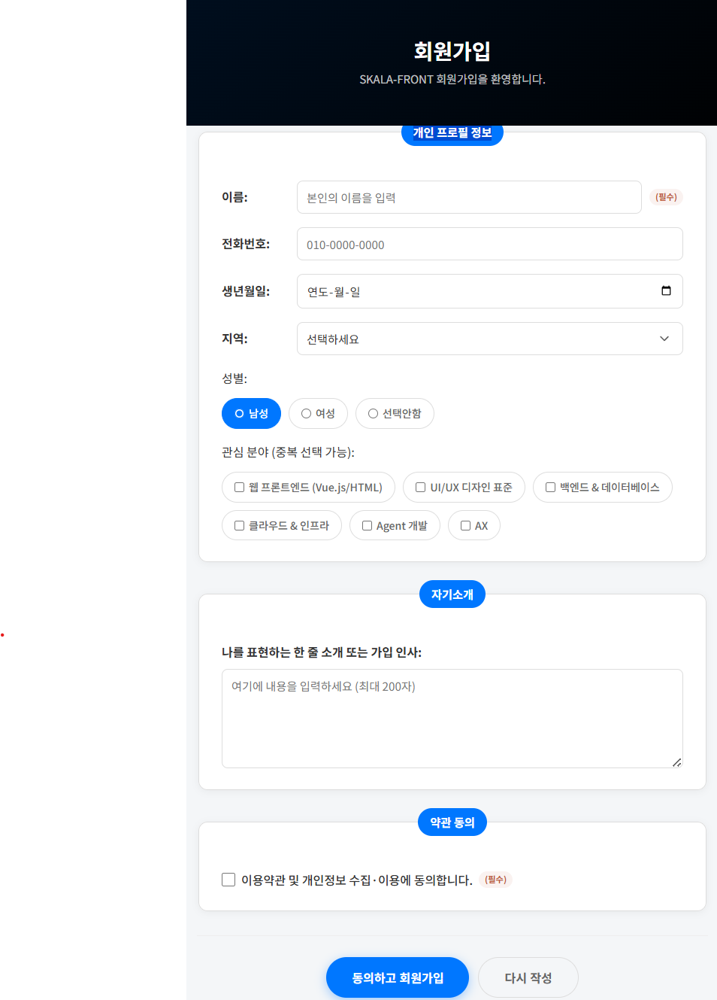
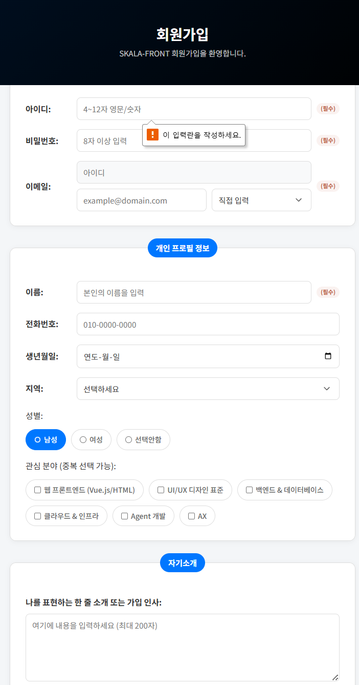
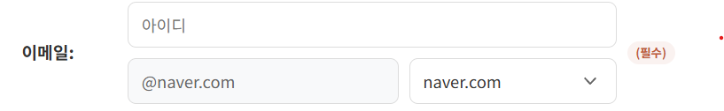
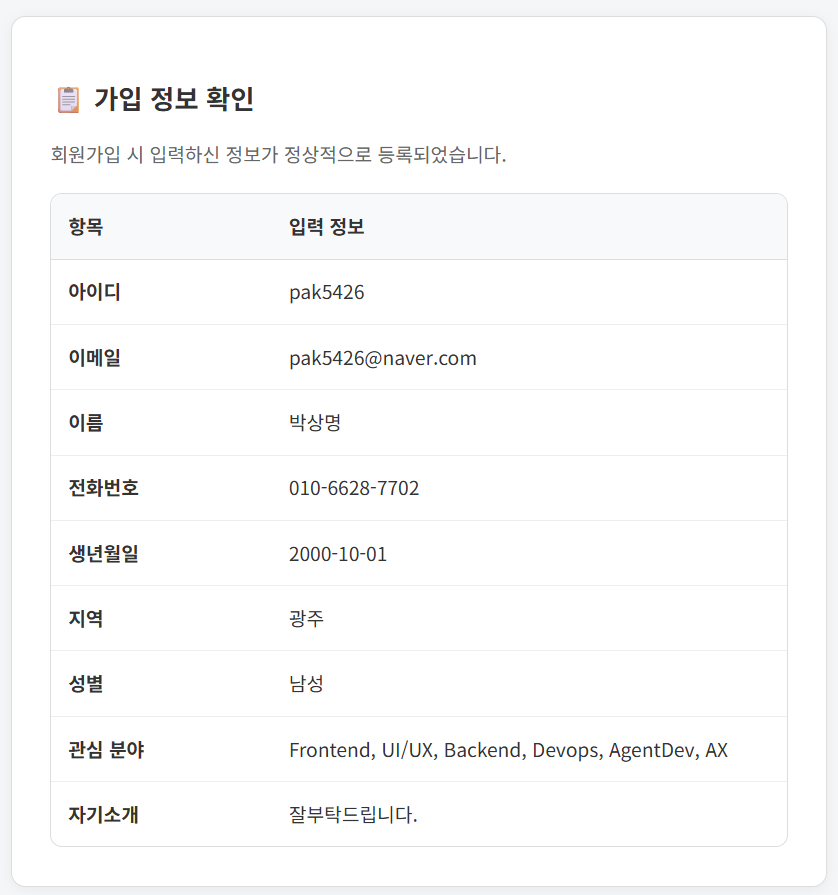
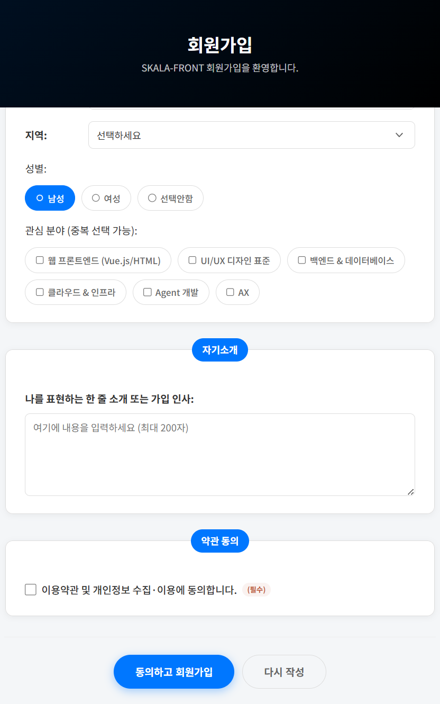
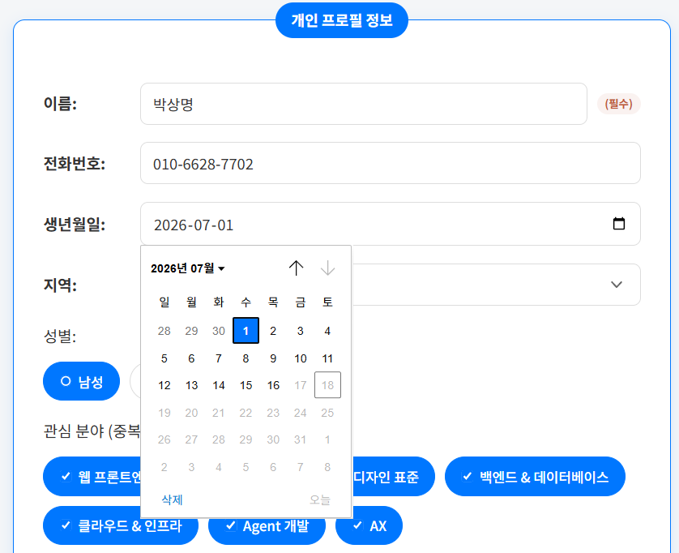

# 종합실습① 회원가입 & 결과 페이지

## 1. 구현 내용

회원가입 폼을 만들고, 제출한 값을 결과 페이지에서 표로 확인할 수 있게 만든 페이지입니다.

`01_signUp.html`은 아이디 · 비밀번호 · 이메일 · 이름 · 전화번호 · 생년월일 · 지역 · 성별 · 관심분야 · 자기소개까지 입력 종류가 다른 항목들을 각각 알맞은 input type(`text/password/email/tel/date/radio/checkbox/select/textarea`)으로 구성했고, `required`/`pattern`/`minlength` 같은 HTML5 자체 검증만으로 잘못된 입력을 막도록 했습니다. 

이메일은 "아이디 입력 + 도메인 select" 조합으로 나눠서 도메인을 고르면 자동으로 합쳐지는 자동완성 기능을 넣었습니다. 상단 헤더는 `position: fixed`로 고정해 스크롤해도 항상 보이게 했습니다.

제출 버튼을 누르면 `method="get"`으로 `01_signUpResult.html`로 이동하고, 이 페이지는 URL 쿼리스트링에 담겨온 값을 `URLSearchParams`로 읽어와 표(table) 형태로 정리해 보여줍니다. 관심분야처럼 복수 선택된 체크박스 값도 전부 콤마로 이어붙여 표시됩니다.

### 사용 파일
- HTML: [`01_signUp.html`](./01_signUp.html), [`01_signUpResult.html`](./01_signUpResult.html)
- CSS: `CSS/style_signUp.css`
- JS: 없음

## 2. 실행 결과 캡쳐 사진

> 아래 항목 순서대로 스크린샷을 캡처해 `screenshots/` 폴더에 넣고, 파일명을 맞춰주세요. 특히 3 · 5번은 제가 가이드 범위를 넘어 직접 구현한 부분이라 꼭 챙겨서 캡처해주세요.

1. **회원가입 폼 전체 화면** (초기 상태) — 전체 입력 필드가 보이는 화면
   
2. **필수값 미입력 시 브라우저 검증 경고** — 아무것도 입력하지 않고 제출 버튼을 눌렀을 때 뜨는 브라우저 기본 경고 문구
   
3. **이메일 도메인 자동완성 동작** — 도메인 select에서 `naver.com`을 선택해 이메일 input이 `아이디@naver.com`으로 자동 조합된 상태 (직접 구현한 부분)
   
4. **결과 페이지 — 표에 값이 채워진 화면** — 관심분야 등 복수 선택 항목이 콤마로 함께 표시되는지 보이도록
   
5. **결과 페이지 스크롤 중 헤더 고정 확인** — 페이지를 아래로 스크롤한 상태에서 헤더가 화면 상단에 그대로 고정되어 있는 캡처
   
6. **생년월일 입력 범위 제한** — `min="1900-01-01"` ~ 작동 시점 날짜 사이의 값만 입력 가능하도록 막아낸 기능(날짜 선택 캘린더에서 범위 밖 날짜가 비활성화된 상태)
   

## 3. 결과물에 대한 평가 (가이드 지시 내용)

가이드가 요구한 필수 항목(이름 · 아이디 · 비밀번호 · 이메일 · 약관동의)에 `required`를 걸고, 아이디는 `pattern="[a-zA-Z0-9]{4,12}"`, 비밀번호는 `minlength=8`, 전화번호는 `pattern="010-[0-9]{4}-[0-9]{4}"`만 통과하도록 만든 것이 이 과제의 기본 뼈대였습니다. 계정 정보 / 개인 프로필 / 자기소개 / 약관 동의를 `fieldset`+`legend`로 묶고, 헤더를 `position: fixed`+`z-index`로 고정한 것도 가이드가 명시한 요구사항을 그대로 따른 부분입니다.

이 중 가장 크게 배운 부분은 `method="get"` 제출과 결과 페이지 파싱 과정이었습니다. `method="get"`으로 제출하면 비밀번호를 포함한 모든 값이 URL에 그대로 노출된다는 점을 실제로 확인하게 됐는데, 이번 실습 목적(값 전달 확인)에는 문제가 없지만 실제 서비스라면 `method="post"`로 바꾸고 서버에서 처리해야 한다는 걸 몸으로 배웠습니다. 또한 관심분야처럼 같은 `name`의 체크박스가 여러 개 선택되면 `URLSearchParams.get()`이 아니라 `getAll()`로 받아야 한다는 것도, 처음엔 값이 하나만 표시돼서 원인을 찾다가 알게 됐습니다.

## 4. 추가과제 (지시되지 않은 내용)

가이드에는 없지만, 이메일 입력을 "아이디 입력용 input + 실제 전송용 이메일 input + 도메인 select" 조합으로 나눠서 도메인을 고르면 자동으로 합쳐지는 자동완성 기능을 직접 추가했습니다. 도메인을 select로 고르면 `change` 이벤트로 실제 이메일 input을 읽기 전용으로 바꾸면서 자동 조합된 값만 보여주고, "직접 입력"을 다시 고르면 값을 비우고 자유 입력 상태로 되돌리는 방식으로 구현했습니다. 처음엔 "지금 어느 input이 진짜 값의 출처인지"가 헷갈려서 상태가 꼬이는 문제를 겪었는데, `disabled`/`readOnly` 속성을 명확히 나눠서 항상 한쪽만 입력 가능하도록 정리하고 나서야 의도대로 동작했습니다.

## 5. GitHub 링크
https://github.com/SangMyeong5426/skala-front
