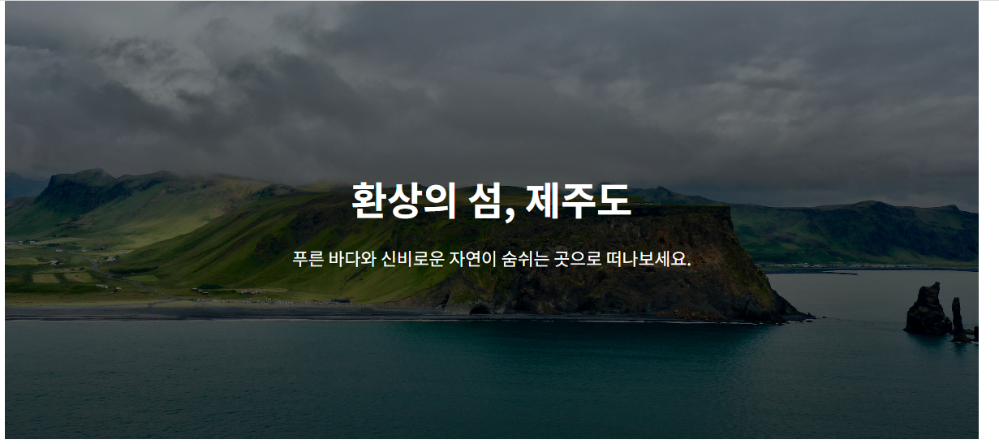
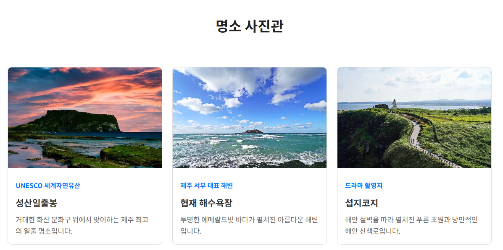
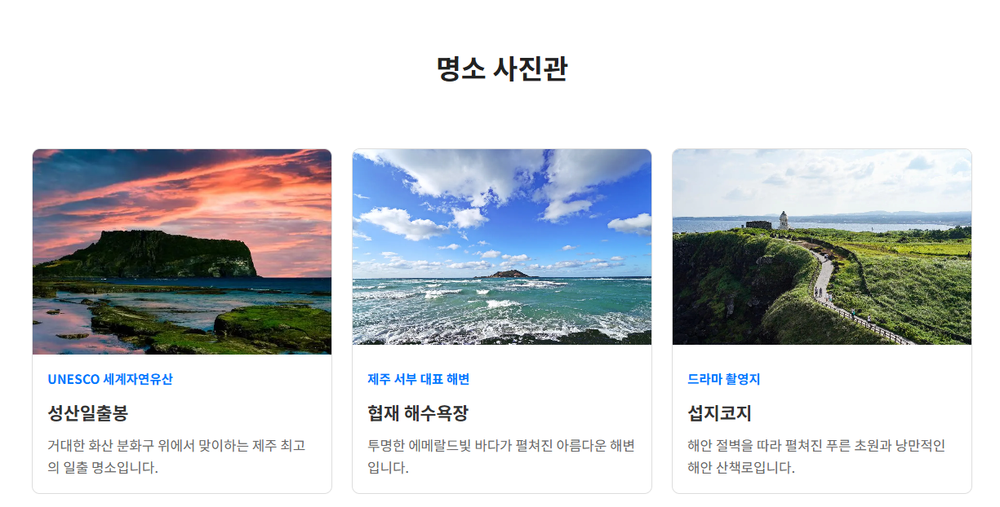
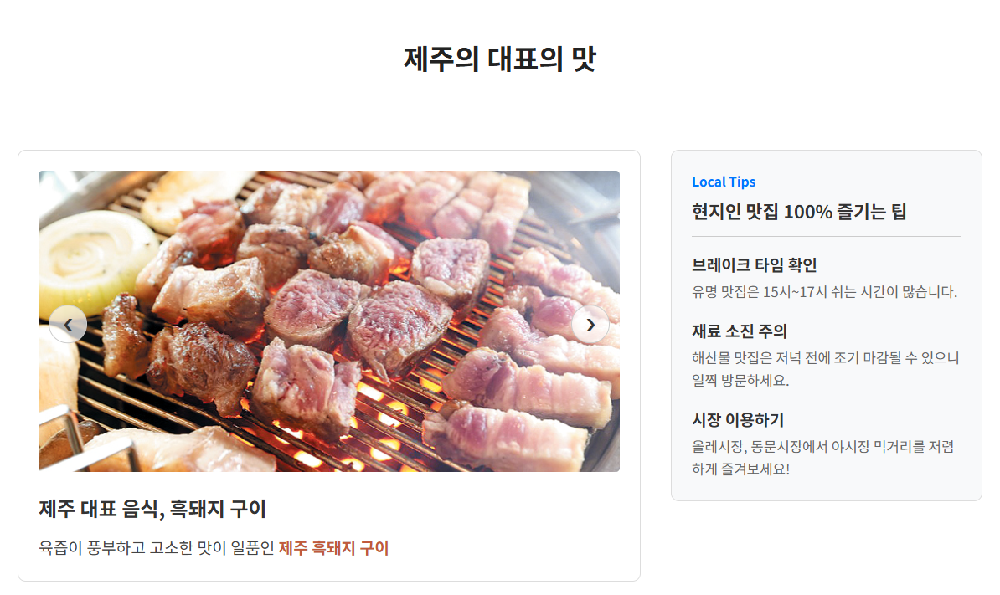
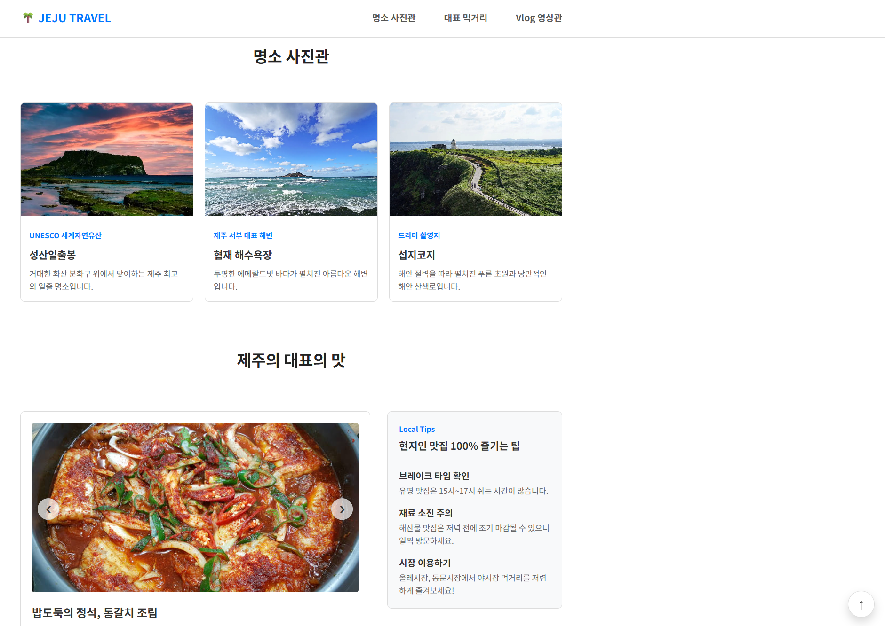
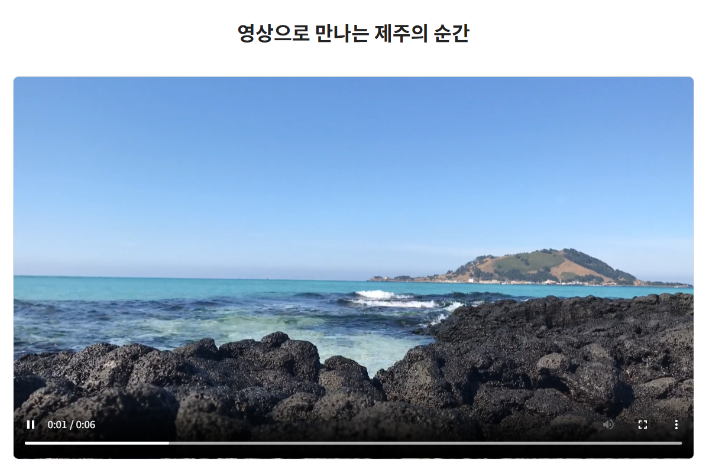

# 종합실습② 여행지 소개 페이지

## 1. 구현 내용

제주도 여행지를 소개하는 시맨틱 구조의 원페이지 웹사이트입니다.

`header/nav/main/section/article/aside/footer` 시맨틱 태그로 전체 구조를 짰고, 상단 내비게이션은 `position: fixed`로 고정한 채 각 메뉴를 `href="#섹션id"` 앵커로 연결해 클릭 시 부드럽게 스크롤 이동하도록 했습니다(`scroll-behavior: smooth`). 

히어로 영역은 배경 이미지 위에 그라데이션을 겹쳐 텍스트 가독성을 확보했고, 명소 갤러리는 `figure`+`figcaption` 3개, 먹거리 섹션은 이미지 슬라이더가 있는 `article`과 팁 `aside`를 2단으로 배치했습니다. 영상 섹션은 `video`에 `controls`/`poster`를 적용했습니다. 

화면 우측 하단에는 스크롤에 반응해 나타나는 플로팅 "맨 위로" 버튼을 직접 추가했습니다.

### 사용 파일
- HTML: [`02_tripDestIntro.html`](./02_tripDestIntro.html)
- CSS: `CSS/style_tripIntro.css`
- JS: 없음

## 2. 실행 결과 캡쳐 사진

> 아래 항목 순서대로 스크린샷을 캡처해 `screenshots/` 폴더에 넣어주세요. 4번은 제가 가이드 범위를 넘어 직접 구현한 부분이라 꼭 챙겨서 캡처해주세요.

1. **히어로 영역 전체 화면** — 그라데이션 오버레이 + 배경 이미지가 겹쳐진 첫 화면
   
2. **명소 갤러리 hover 확대 효과 (전/후 비교)** — 명소 카드에 마우스를 올리기 전/올린 후 이미지 확대 상태 비교
   
   
3. **먹거리 슬라이더 전환 전/후 비교** — 이전/다음 버튼을 눌러 음식이 바뀐 화면 두 장(전/후)
   
   
4. **스크롤 후 플로팅 "맨 위로" 버튼 등장 화면** — 아래로 스크롤했을 때 우측 하단에 버튼이 나타난 상태 (직접 구현한 부분)
   
5. **영상 섹션 재생 화면** — 영상 재생 버튼을 눌러 재생 중인 상태
   

## 3. 결과물에 대한 평가 (가이드 지시 내용)

가이드가 요구한 시맨틱 구조(`header/nav/main/section/article/aside/footer`), `position: fixed` 내비게이션 + 앵커 이동, `figure`+`figcaption` 갤러리 3개, `article`+`aside` 2단 배치, `video` `controls`/`poster`는 전부 지시된 그대로 구현했습니다. 그중 가장 신경 쓴 부분은 먹거리 섹션의 이미지 슬라이더입니다. 단순히 이미지를 바로 바꾸면 딱딱해 보여서, 현재 이미지/텍스트를 진행 방향으로 먼저 밀어낸 뒤 화면 밖에서 내용을 바꾸고, 반대쪽 화면 밖으로 트랜지션 없이 순간이동시킨 다음 다시 슬라이드 인시키는 4단계로 만들었습니다. 이 과정에서 "내용을 바꾼 직후 위치를 순간이동시켜도 트랜지션이 그 이동까지 애니메이션으로 처리해버려서 화면이 이상하게 튀는" 문제를 겪었는데, `void element.offsetWidth`로 강제 리플로우를 한 번 일으켜 브라우저가 순간이동한 위치를 먼저 확정하게 만든 뒤에야 트랜지션을 다시 켜는 방식으로 해결했습니다. 이 트릭을 몰랐을 땐 왜 자꾸 반대 방향에서 잘못 들어오는지 원인을 찾는 데 시간이 꽤 걸렸습니다.

## 4. 추가과제 (지시되지 않은 내용)

플로팅 "맨 위로" 버튼은 가이드에 없는 개인 확장 기능입니다. 원래는 footer 안의 정적인 링크였는데, 스크롤이 300px 이상 내려갔을 때만 나타나도록 `scroll` 이벤트로 감지해 `classList`를 토글하고, 클릭 시 `scrollTo({behavior: 'smooth'})`로 부드럽게 최상단까지 이동하도록 직접 개선했습니다. `opacity`/`visibility`/`transform`을 함께 트랜지션시켜서 버튼이 살짝 아래에서 떠오르며 나타나는 디테일까지 챙겼습니다.

## 5. GitHub 링크
https://github.com/SangMyeong5426/skala-front
