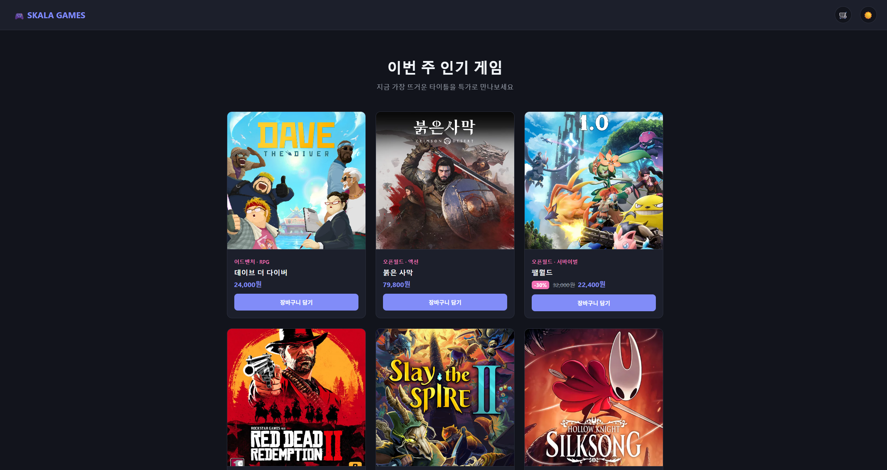

# 종합실습① 반응형 상품 카드 갤러리

## 1. 구현 내용

게임 판매 플랫폼을 컨셉으로 한 반응형 상품 갤러리이자, 실제로 동작하는 장바구니 · 구매 기능까지 갖춘 미니 쇼핑몰입니다.

`:root`에 정의한 8개 색상 변수(`--color-bg`, `--color-primary` 등)를 전 구간 `var()`로 사용해서, 다크모드 버튼을 누르면 `body.dark` 클래스 하나로 전체 색상 테마가 전환됩니다. 상품 카드 6개는 CSS Grid로 배치되어 화면 폭에 따라 3열 → 2열(900px 이하) → 1열(600px 이하)로 바뀌고, 카드에 마우스를 올리면 떠오르는 효과와 함께 게임 소개 문구가 담긴 오버레이가 나타납니다. 여기에 더해 장바구니 담기/삭제/합계 계산, 상품 이미지가 장바구니로 "날아가는" 애니메이션, `<dialog>` 요소를 이용한 구매 완료 모달까지 자바스크립트로 구현했습니다.

### 사용 파일
- HTML: [`01_product_gallery.html`](./01_product_gallery.html)
- CSS: `CSS/style_productGallery.css`
- JS: 없음 (`<script>` 인라인 스크립트만 사용 — 다크모드 토글, 장바구니 로직, 날아가는 애니메이션, 구매 모달)

## 2. 실행 결과 캡쳐 사진

> 아래 항목 순서대로 스크린샷을 캡처해 `screenshots/` 폴더에 넣어주세요. 3 · 4 · 5 · 6번은 제가 가이드 범위를 넘어 직접 구현한 핵심 부분이라 특히 꼼꼼히 캡처해주세요.

1. **라이트모드 전체 화면** — 초기 진입 화면, 상품 카드 6개가 3열로 배치된 상태
   
2. **다크모드 전체 화면** — 다크모드 버튼 클릭 후, 색상 테마가 전환된 상태 (가이드 요구사항)
   
3. **카드 hover 시 소개 오버레이** — 상품 카드에 마우스를 올려 그라데이션+소개 문구가 보이는 상태 (직접 구현)
   
4. **장바구니 패널 열림 + 상품 담긴 상태** — 상품을 담아 뱃지 개수와 합계까지 표시된 장바구니 패널 (직접 구현)
   
5. **상품이 장바구니로 날아가는 애니메이션** — "장바구니 담기" 클릭 직후 화면 (직접 구현)
   
6. **구매 완료 모달 화면** — "구매하기" 클릭 후 뜨는 `<dialog>` 모달 (직접 구현)
   
7. **반응형 2열 화면** — 개발자 도구 반응형 모드에서 폭을 900px 이하로 줄여 카드가 2열로 배치된 상태
   

## 3. 결과물에 대한 평가 (가이드 지시 내용)

`:root`에 색상 변수 8개를 정의해 전 구간 `var()`로 사용하고, 상품 카드 6개를 `display: grid`+`repeat(3, 1fr)`로 배치한 뒤 `@media`로 900px 이하 2열/600px 이하 1열이 되도록 만든 것이 가이드의 필수 요구사항이었습니다. 상단바는 `space-between`+`margin-left: auto`로 정렬했고, 카드 hover 시 `translateY`+그림자 강화, 히어로 문구는 `@keyframes`로 순차 등장하도록 만든 것도 세부 요구사항 그대로입니다.

이 중 가장 신경 쓴 기능은 가이드가 명시한 CSS 변수 기반 다크모드입니다. 자바스크립트는 `body.classList.toggle("dark")` 딱 한 줄만 하고, 실제 색이 바뀌는 로직은 전부 CSS `body.dark { --color-bg: ...; }` 재정의에 맡겼습니다. 자바스크립트와 스타일의 역할을 확실히 분리한 부분이라 스스로도 만족스러운 설계였습니다.

## 4. 추가과제 (지시되지 않은 내용)

가이드 범위를 넘어 자바스크립트로 실제 쇼핑몰처럼 동작하는 기능을 추가로 얹었습니다.

가장 핵심적으로 구현한 것은 상품 이미지가 장바구니로 날아가는 애니메이션입니다. 상품 썸네일을 `cloneNode()`로 복제해 원본 위치(`getBoundingClientRect()`)에 겹쳐놓고, 목표 지점인 장바구니 버튼과의 좌표 차이(`dx`, `dy`)를 계산해 `transform: translate(dx, dy) scale(0.08)`로 이동·축소시켰습니다. 처음엔 스타일을 대입해도 트랜지션 없이 바로 최종 위치로 뚝 떨어지는 문제가 있었는데, 원인은 브라우저가 "시작 상태"를 그리기도 전에 "도착 상태"까지 한 번에 적용해버린 것이었습니다. `void clone.offsetWidth`로 강제 리플로우를 한 번 일으켜 시작 상태를 먼저 확정시킨 뒤 도착 상태를 적용하니 의도한 대로 부드럽게 날아가는 애니메이션이 완성됐습니다. 애니메이션이 끝나면 `transitionend` 이벤트로 복제 요소를 지우되, 혹시 이벤트가 안 걸리는 경우를 대비해 800ms 타임아웃도 백업으로 걸어뒀습니다.

장바구니 배열 로직에서는 이미 담긴 상품인지 `cart.find(item => item.name === name)`로 확인해서 있으면 수량만 늘리고, 없으면 새로 추가하는 방식으로 처리했는데, 상품명을 key처럼 사용하는 이 방식이 간단하면서도 충분히 잘 동작한다는 걸 확인했습니다. 구매 완료 화면은 별도 모달 라이브러리 없이 순수 HTML `<dialog>` 요소를 `showModal()`로 띄웠는데, 배경 딤 처리(`::backdrop`)와 포커스 트랩까지 브라우저가 공짜로 처리해준다는 걸 이번에 처음 알았습니다. 카드 hover 시 뜨는 소개 오버레이는 `.product-thumb-wrap` 안에 이미지와 그라데이션+텍스트를 겹쳐두고 `:hover`로 opacity만 토글한 것이라 구현 자체는 간단했지만, 6개 게임 소개 문구를 직접 다 써넣는 게 은근히 품이 들었습니다.

## 5. GitHub 링크
https://github.com/SangMyeong5426/skala-front
