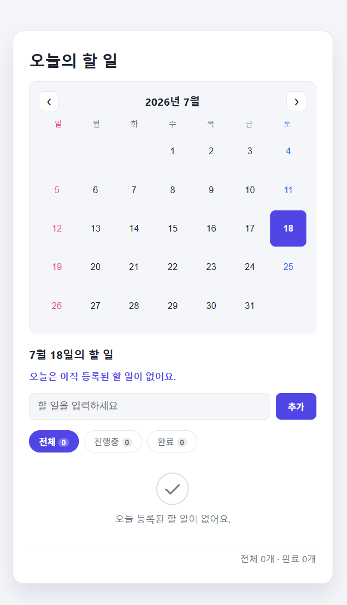
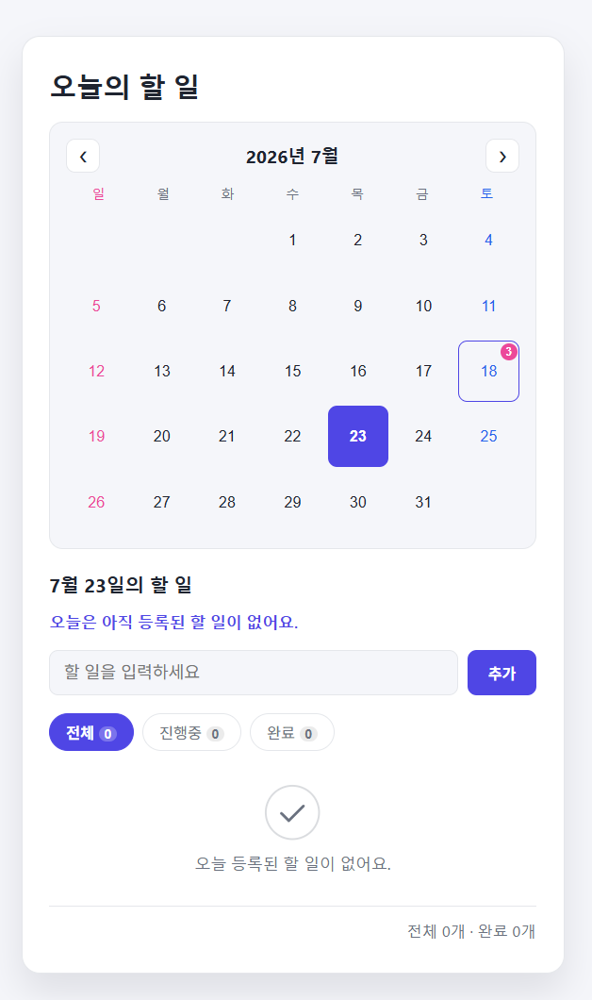
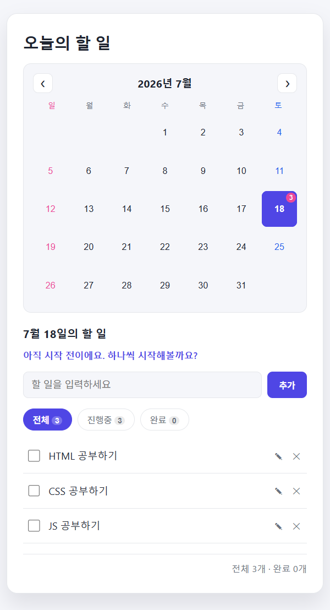
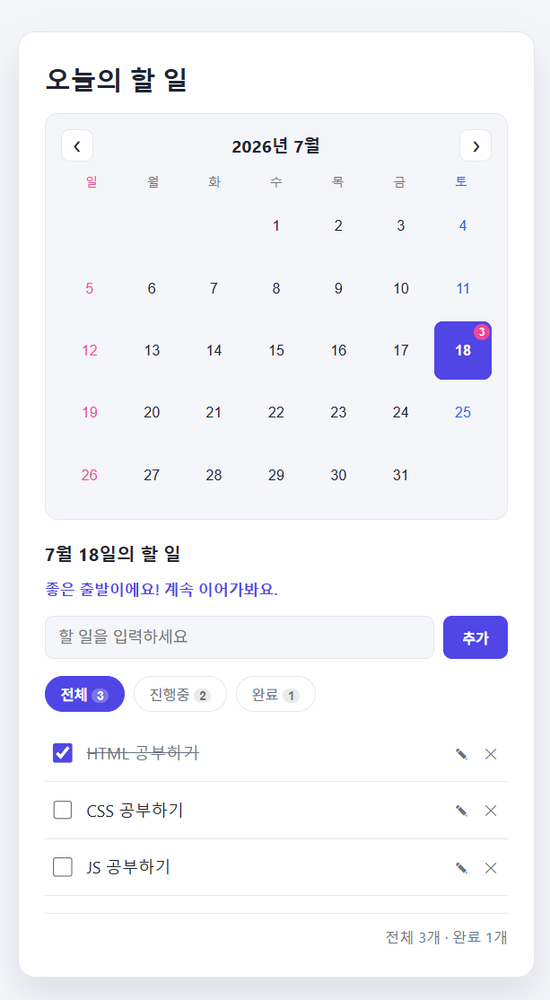
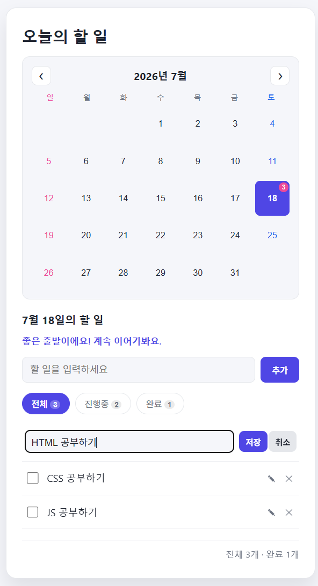
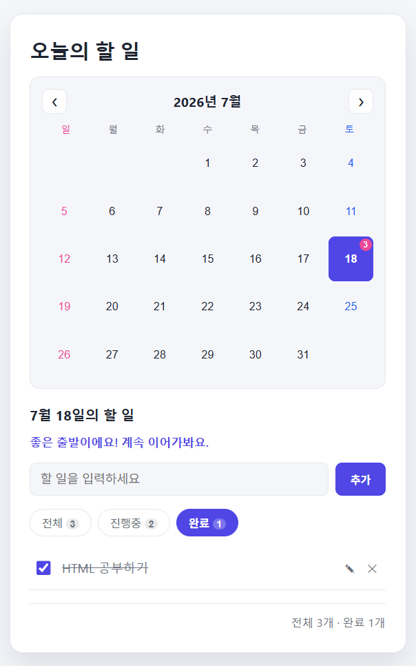
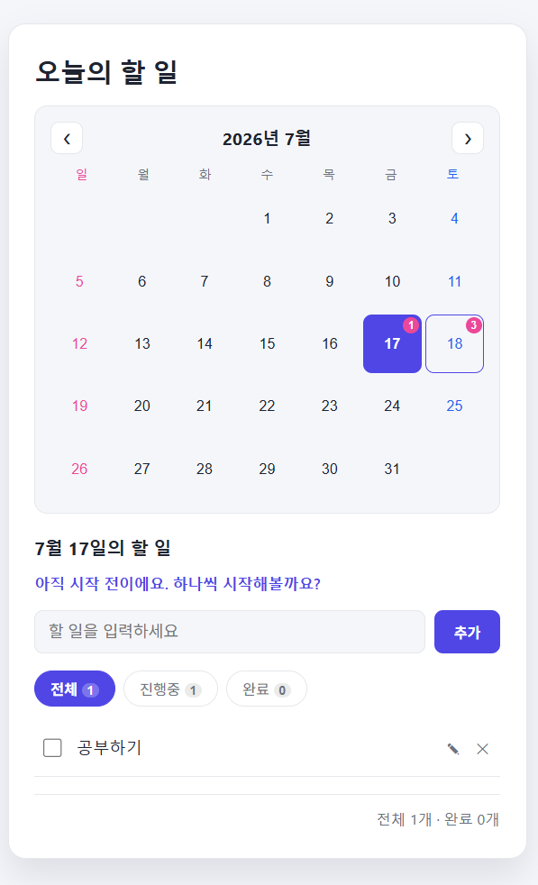
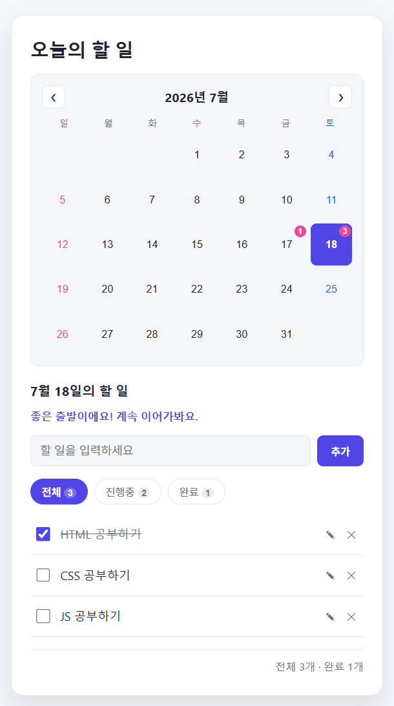
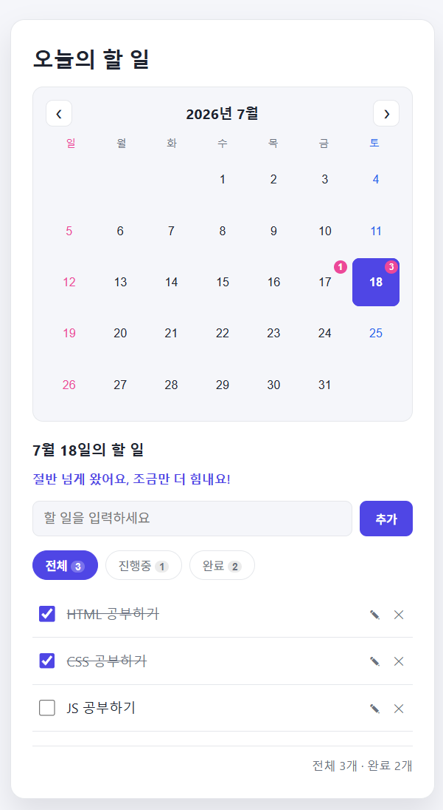
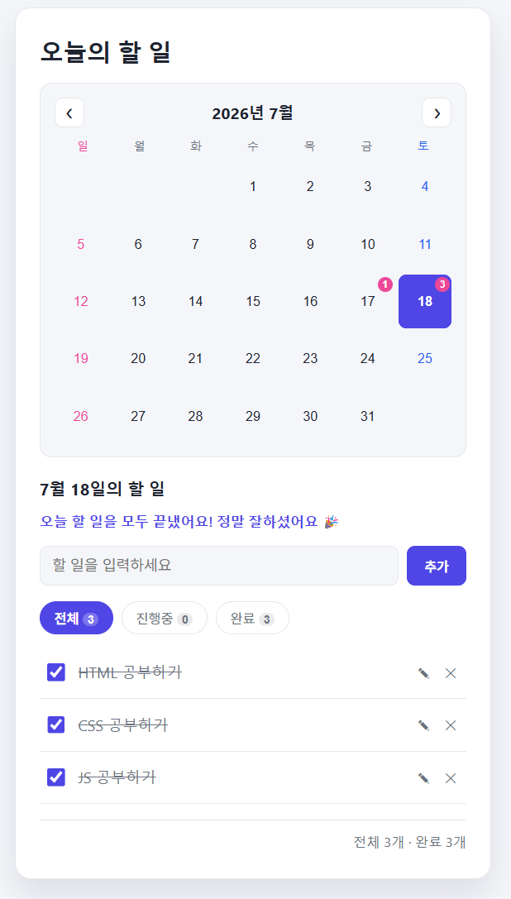

# 종합실습② 인터랙티브 할 일 관리 앱

## 1. 구현 내용

날짜별로 할 일을 관리하는 캘린더 연동형 투두 앱입니다. `type="module"`을 사용하므로 반드시 로컬 서버(Live Server 또는 `python -m http.server`)로 실행해야 합니다.

할 일 하나를 `{id, text, done, date}` 객체로 두고 배열 전체를 상태로 관리하며, 입력 후 Enter 또는 추가 버튼으로 추가(빈 값 방지), 체크박스로 완료 토글(취소선 표시), ✕ 버튼으로 삭제할 수 있습니다. 전체/진행중/완료 필터(개수 배지 포함)와 하단 요약("전체 N개 · 완료 M개")도 제공합니다. 여기에 더해 월간 캘린더(날짜별 개수 뱃지, 요일 색상 강조, 날짜 클릭 조회), 항목 인라인 수정, 추가/삭제/완료 애니메이션, 완료율에 따라 달라지는 피드백 문구(비동기 `fetch`)까지 직접 구현했습니다. `storage.js`(데이터 저장) / `app.js`(화면 렌더링)로 모듈을 분리했고, `localStorage`에 저장해 새로고침해도 데이터가 유지됩니다.

### 사용 파일
- HTML: [`02_todo_app.html`](./02_todo_app.html)
- CSS: `CSS/style_todoApp.css`
- JS: `js/todo/app.js`(화면 렌더링/이벤트 처리), `js/todo/storage.js`(localStorage 저장/복원), `js/todo/feedback.json`(완료율별 피드백 문구 데이터)

## 2. 실행 결과 캡쳐 사진

> 아래 항목 순서대로 스크린샷을 캡처해 `screenshots/` 폴더에 넣어주세요. 1 · 2 · 5 · 7번은 제가 가이드 범위를 넘어 직접 구현한 핵심 부분이라 특히 꼼꼼히 캡처해주세요.

1. **캘린더 초기 화면** — 일요일/토요일 색상 강조와 날짜별 할 일 개수 뱃지가 보이는 상태 (직접 구현)
   
2. **날짜 클릭 후 해당 날짜 목록 화면** — 다른 날짜를 클릭해 그 날의 할 일만 보이는 상태 (직접 구현)
   
3. **할 일 추가 후 목록 화면** — 여러 개 추가한 상태
   
4. **완료 체크 화면** — 체크박스를 눌러 취소선이 표시되고 하단 요약 개수가 바뀐 상태
   
5. **인라인 수정 모드 화면** — 연필 아이콘을 눌러 입력창+저장/취소 버튼으로 바뀐 상태 (직접 구현)
   
6. **필터 동작 화면** — "완료" 필터를 눌러 완료 항목만 보이는 상태
   
7. **완료율 피드백 문구 비교** — `feedback.json`의 4개 구간(0% / 1~49% / 50~99% / 100%)에 맞춰 문구가 각각 다르게 표시되는 화면 4장 (직접 구현)
   
   
   
   

## 3. 결과물에 대한 평가 (가이드 지시 내용)

가이드가 요구한 기본 뼈대부터 정리하면, 할 일 하나를 `{id, text, done, date}` 객체로 두고 배열 전체(`todos`)를 상태로 관리했습니다. Enter 또는 추가 버튼으로 추가(빈 값 방지), 체크박스로 완료 토글(취소선), ✕ 버튼으로 삭제하는 필수 기능과, 전체/진행중/완료 필터+하단 요약("전체 N개 · 완료 M개")이라는 세부 요구사항을 전부 구현했습니다. 동적으로 추가/삭제되는 항목들을 개별 리스너 없이 처리하기 위해, 부모 `ul`(`todoList`) 하나에만 `click`/`keydown` 리스너를 걸고 `e.target.closest("li")`+`e.target.matches(...)`로 어떤 버튼이 눌렸는지 분기하는 이벤트 위임 방식을 썼습니다.

가이드의 추가 요구사항인 모듈 분리와 영속성도 챙겼습니다. `storage.js`는 `load()`/`save()` 두 함수만 export해서 `localStorage` 저장/복원만 책임지고, `app.js`는 이걸 `import`해서 화면을 그리는 데만 집중하도록 나눴습니다. 그래서 나중에 저장 방식을 서버 API로 바꾸더라도 `app.js`의 렌더링 로직은 거의 안 건드려도 되는 구조입니다. "비동기 fetch + 실패 시 기본 문구" 요구사항은 `feedback.json`을 `async/await`+`fetch`로 불러오고 `try/catch`로 감싸서, 요청이 실패하면 `feedbackTiers`가 `null`이 되어 고정 문구로 자동 대체되도록 구현했습니다(구체적으로 어떤 문구를 보여줄지는 4번 추가과제에서 설명합니다).

## 4. 추가과제 (지시되지 않은 내용)

가이드는 단순한 리스트형 앱만 요구했지만, 아래 기능들을 추가로 구현했습니다.

가장 핵심적으로 구현한 기능은 날짜별 할 일 관리(월간 캘린더 연동)입니다. 단순 배열이 아니라 모든 할 일에 `date` 필드를 붙이고, 목록·필터·요약·캘린더 뱃지가 전부 `todos.filter(t => t.date === selectedDate)`로 뽑아낸 "선택된 날짜의 할 일"만 기준으로 다시 계산되도록 만들었습니다. 캘린더 자체는 `new Date(year, month, 1).getDay()`로 1일의 요일을 구해 앞쪽 빈 칸을, `new Date(year, month+1, 0).getDate()`로 마지막 날짜를 구해 전체 칸 수를 계산하는 방식으로 그렸고, 요일이 0/6이면 일요일/토요일 색을 다르게 강조했습니다. 이 구조를 잡는 데 시간이 꽤 걸렸지만, 그 덕분에 날짜를 넘나들어도 데이터가 꼬이지 않는 걸 확인했을 때 뿌듯했습니다.

두 번째는 인라인 수정 기능입니다. `editingId`라는 상태를 하나 더 둬서, 목록을 그릴 때 `todo.id === editingId`이면 일반 모드 대신 입력창+저장/취소 버튼으로 그리는 조건부 렌더링을 구현했습니다.

세 번째는 가이드가 요구한 fetch 메커니즘의 내용물을 직접 설계한 부분입니다. 흔한 "오늘의 명언" 대신, 선택한 날짜의 실제 완료율(%)에 따라 다른 문구가 뜨도록 `feedback.json`에 구간별 문구(`{min, max, message}`)를 만들어두고 해당 구간을 찾아 보여주게 했습니다. 단순히 랜덤 문구를 뿌리는 게 아니라 앱의 실제 데이터와 엮이도록 설계했다는 점에서 차별화하려 했습니다.

가장 어려웠던 부분은 추가/삭제/완료 애니메이션이었습니다. 목록을 렌더링할 때마다 DOM을 전부 지우고 다시 그리는 구조라서, 완료 처리 시 배경이 반짝이는 효과(`pulse`)나 삭제 시 페이드아웃 효과를 넣으려 해도 클래스를 요소 생성과 동시에 붙이면 브라우저가 "이미 그 상태"로 인식해 트랜지션이 아예 재생되지 않는 문제를 겪었습니다. `requestAnimationFrame`으로 한 프레임 늦게 클래스를 붙이거나(pulse), 실제 배열 삭제를 애니메이션 재생 시간(250ms)만큼 `setTimeout`으로 미루는(삭제) 방식으로 해결했습니다. 이 과정에서 "화면을 다시 그리는 것"과 "그 안에서 애니메이션이 자연스럽게 보이는 것"이 서로 다른 문제라는 걸 배웠습니다.

## 5. GitHub 링크
https://github.com/SangMyeong5426/skala-front
